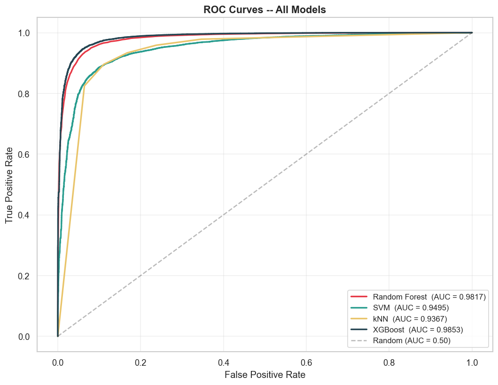
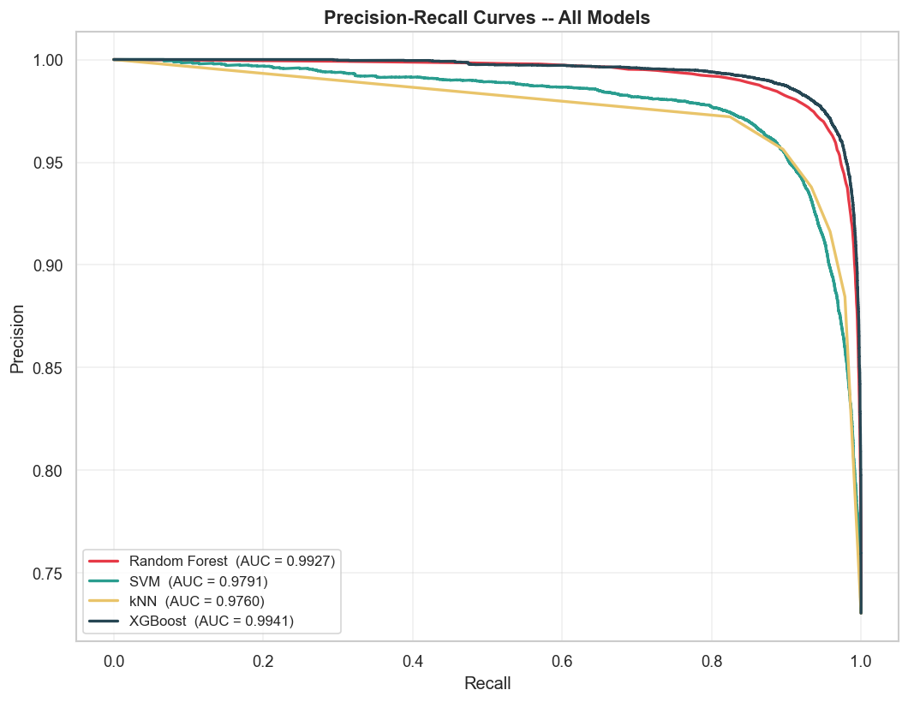

# Machine Learning-Based Ransomware Detection Using Low-Level Memory Access Patterns

A machine learning system that detects ransomware from **low-level memory and storage access behavior** instead of traditional signature-based detection. It is built on the RanSMAP 2024 dataset. Four classifiers are trained and compared, and a Streamlit web app lets you upload a feature file and get predictions from the model of your choice.

## Highlights

- Predicts whether a sample is **ransomware (malicious) or benign** from 28 numeric features.
- Compares **Random Forest, SVM, k-NN and XGBoost**. XGBoost performed best (F1 0.964, ROC-AUC 0.985).
- Uses **StratifiedGroupKFold** cross-validation, grouped by trial, so rows from the same trial never appear in both train and test.
- Includes a **Streamlit app** with CSV upload and model selection.

## Dataset

This project uses the **RanSMAP 2024 (Ransomware Storage and Memory Access Patterns)** dataset by M. Hirano and R. Kobayashi.

The dataset and the generated Parquet files are **not included** in this repository because of GitHub's file size limits. Download the dataset here:
https://www.kaggle.com/datasets/hiranomanabu/ransmap-2024-ransomware-behavioral-features

The dataset contains **1,970 trial runs** across four splits:

- Original (1,440)
- Extra (360)
- Mix (100)
- Variants (70)

Each trial has six behavioral log files: `mem_write.csv`, `mem_read.csv`, `mem_exec.csv`, `mem_readwrite.csv`, `ata_write.csv` and `ata_read.csv`. They record low-level memory and storage events such as timestamps, Guest Physical Address (GPA) or Logical Block Address (LBA), entropy and page type.

## Project Workflow

The work is organized in phases (see the `notebooks/` folder):

| Phase | File | What it does |
| ----- | ---- | ------------ |
| 1 | `phase1_data_loading.py` | Loads the raw log files and combines them with metadata (class name, trial ID, label) |
| 2 | `phase2_eda.ipynb` | Explores the data and compares ransomware and benign behavior |
| 3 | `phase3_feature_engineering.ipynb` | Builds the 28 model features from the raw events |
| 4 | `phase4_models.ipynb` | Trains Random Forest, SVM, k-NN and XGBoost |
| 5 | `phase5_evaluation.ipynb` | Evaluates the models with F1, ROC and Precision-Recall curves |

After feature engineering, the final table has **137,406 rows**. Each row has 28 features plus label and metadata columns.

## Features

The 28 input features are computed for each access type (`write`, `read`, `exec`, `readwrite`, `ata_write`, `ata_read`):

- `entropy_avg_*`: average entropy of the accessed data (write, readwrite, ata_write and ata_read)
- `count_4kb_*`, `count_2mb_*`, `count_mmio_*`: number of accesses by page type
- `addr_var_*`: variation in the accessed addresses

Example column names: `entropy_avg_write`, `count_4kb_read`, `addr_var_exec`, `count_mmio_ata_write`.

## Results

Models were evaluated with StratifiedGroupKFold cross-validation, grouped by trial to prevent data leakage.

| Model | F1 Score | ROC-AUC | PR-AUC |
| ----- | -------- | ------- | ------ |
| XGBoost | **0.9638** | **0.9853** | **0.9941** |
| Random Forest | 0.9624 | 0.9817 | 0.9927 |
| k-Nearest Neighbors | 0.9357 | 0.9367 | 0.9760 |
| Support Vector Machine | 0.9219 | 0.9495 | 0.9791 |

XGBoost achieved the best overall performance.





## Running the Project

Python version used: **3.9**

1. Clone the repository and open a terminal in its folder:

```
   git clone https://github.com/TeluGeyasree/RanSMAP-Ransomware-Detection.git
   cd RanSMAP-Ransomware-Detection
```

2. (Recommended) Create and activate a virtual environment. On Windows:

```
   python -m venv venv
   .\venv\Scripts\Activate.ps1
```

3. Install the required packages:

```
   pip install -r requirements.txt
```

4. Start the Streamlit app:

```
   streamlit run app.py
```

5. In the app, upload `sample_data.csv` (included in this repo), choose a model, and view the predictions.

## Sample Input

`sample_data.csv` has **50 rows (25 benign, 25 malicious)** and the 28 input feature columns, with no label column. It is for trying the app only and is not representative of the full dataset's class balance. `make_sample_input.py` shows how it was created. It needs the processed dataset, which you can regenerate by running the notebooks on the Kaggle data.

## Repository Structure

```
├── MODELS/               Saved model, scaler and feature list
├── RESULTS/              ROC and Precision-Recall plots
├── notebooks/            Phase 1-5 code (loading, EDA, features, models, evaluation)
├── app.py                Streamlit web app
├── make_sample_input.py  Script used to create the sample file
├── requirements.txt      Python dependencies
├── sample_data.csv       Sample input for the app
└── README.md
```

## Limitations

- The app does **batch prediction** on an uploaded CSV. It does not monitor a live system.
- The were trained and evaluated only on RanSMAP. Ransomware families and benign programs outside this dataset were not tested, so performance on them is unknown.

## Author

**Telu Geyasree**: [GitHub](https://github.com/TeluGeyasree)

## Reference

M. Hirano and R. Kobayashi, *RanSMAP: Open Dataset of Ransomware Storage and Memory Access Patterns for Creating Deep Learning Based Ransomware Detectors*, Computers & Security, 2024.
